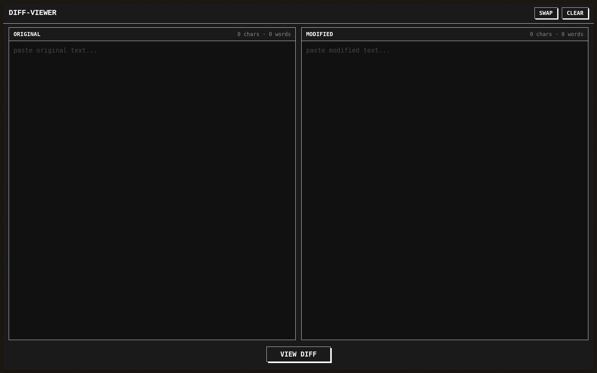

# diff-viewer

A minimal, brutalist, client-side text diff viewer. Paste two bodies of text side-by-side and see exactly what changed — line by line, word by word.

## Features

- **Side-by-side text editors** — paste original and modified text into two panes
- **Drag & drop file loading** — drop a text file onto either pane to load its content
- **Fullscreen diff overlay** — opens a dedicated viewport with split or unified diff views
- **Line-level + word-level diffing** — whole lines are highlighted as added/removed, and individual changed words are highlighted inline
- **Split / Unified toggle** — switch between side-by-side and unified patch-style layout
- **Copy raw diff** — one-click copy of a standard unified diff format to your clipboard
- **Swap texts** — swap the original and modified inputs
- **Clear all** — wipes both editors (with confirmation)
- **Keyboard shortcuts** — `Ctrl+Enter` to diff, `Esc` to close
- **Word & character counters** — live counts in each pane header
- **Brutalist dark aesthetic** — high-contrast, monochrome + red/green diff highlights
- **100% client-side** — no server, no tracking, no cookies

## Usage

1. Open `index.html` in any modern browser
2. Paste your original text in the left pane and the modified text in the right pane (or drag & drop a text file onto either pane)
3. Click **view diff** (or press `Ctrl+Enter`)
4. Toggle between **split** and **unified** views in the overlay
5. Hit **Esc** or click **close** to return

## Tech

- Single self-contained HTML file (no build step, no dependencies)
- [jsdiff](https://github.com/kpdecker/jsdiff) for text comparison
- Vanilla CSS and JavaScript

## License

MIT
